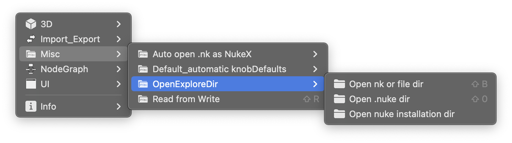

<h1 align='center'>
  openExploreDir
</h1>

## Introduce

Original name: winExploreDir. 

Original author: The code written by Thorsten and released by Varun Hadkar.

The name and code of the script all have been changed by me, `new features` added and available for `Windows`, `Linux`, `Mac`.

 

## Features

open the `current project` directory or the `file knob` directory of the selected node ( like `Read` Node, `Write` Node, `ReadGeo` Node, `Camera` Node, `WriteGeo` Node, `DeepRead` Node, etc )

shortcut: `Shift + B`

---

open the `.nuke` directory

shortcut: `Shift + 0` ( nubmer 0 )

---

open the `nuke installation` directory

 

## Usage
Required: Nuke 13 or later

 

## Installation
You can install this script in your own way.

Alternatively, you can directly install the [PythonScripts Toolkit for Nuke](https://github.com/isLundy/Nuke-PythonScripts-Toolkit.git), where the script shows in the `PythonScripts` menu.

